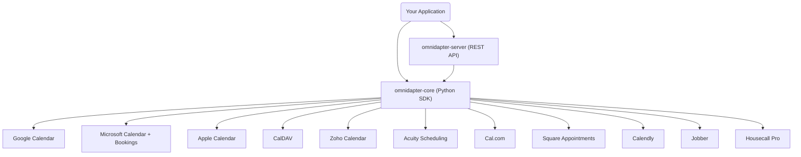

# 🏗️ Omnidapter

**Provider-agnostic calendar and booking integrations for Python and self-hosted APIs.**

Omnidapter is a unified integration engine that eliminates the complexity of supporting multiple calendar and booking providers. Stop writing separate implementations for Google, Acuity, Square, and Cal.com—Omnidapter gives you one consistent API surface and data model.

[](https://opensource.org/licenses/MIT)
[](https://www.python.org/downloads/release/python-3100/)

---

## ⚡ Main Features

- 🔄 **Unified Interface**: One model for events, calendars, bookings, and availability across all providers.
- 🔑 **OAuth Management**: Automated lifecycle for authorization flows, callbacks, and token refreshes.
- 📦 **Dual Distribution**: Use as a **Python SDK** or a standalone **REST API**.
- 🛡️ **Explicit Capability Checks**: Easily determine which features a specific provider supports.
- 💾 **Plug-and-Play Storage**: Clear separation of credential storage from provider logic.
- 📅 **Multi-Service Connections**: A single OAuth connection can authorize both calendar and booking services using per-service scope groups.

---

## 🏛️ Architecture



---

## 🧩 Project Structure

- **[`omnidapter-core`](omnidapter-core/README.md)**: The core Python library. Best if your application is Python-based and you want deep, native integration.
- **[`omnidapter-server`](omnidapter-server/docs/README.md)**: A production-ready FastAPI service that wraps the core. Best for polyglot systems or independent microservices.

---

## 🚀 60-Second Quick Start

### Python Library

```bash
pip install omnidapter
```

```python
from omnidapter import Omnidapter

omni = Omnidapter(
    credential_store=my_enc_store,
    oauth_state_store=my_redis_store,
)

# Calendar: list events from any provider
conn = await omni.connection("google_conn_1")
calendar = conn.calendar()
async for event in calendar.list_events("primary"):
    print(f"[{event.start}] {event.summary}")

# Booking: create an appointment on any booking provider
conn = await omni.connection("acuity_conn_1")
booking_svc = conn.booking()
services = await booking_svc.list_services()
booking = await booking_svc.create_booking(CreateBookingRequest(
    service_id=services[0].id,
    start=datetime(2026, 6, 1, 10, 0, tzinfo=timezone.utc),
    customer=BookingCustomer(name="Jane Doe", email="jane@example.com"),
))
print(f"Booked: {booking.id}")
```

### Self-Hosted API

Pull the latest stack and start services:

```bash
# Setup infrastructure (Postgres + Migration)
docker-compose -f omnidapter-server/docker-compose.yml up -d

# Bootstrap the first API key
uv run --package omnidapter-server omnidapter-bootstrap --name "local-dev"

# Call the API
curl -H "Authorization: Bearer <API_KEY>" \
  http://localhost:8000/v1/providers
```

---

## 🛠️ Supported Providers

### Calendar

| Provider | Status | OAuth | Recurring Events | Free/Busy |
|----------|---------|-------|------------------|-----------|
| **Google** | ✅ Production | Yes | ✅ | ✅ |
| **Microsoft** | ✅ Production | Yes | ✅ | ✅ |
| **Zoho** | ✅ Production | Yes | ✅ | ❌ |
| **Apple** | 🛰️ Beta | App Pass | ✅ | ❌ |
| **CalDAV** | 🛰️ Beta | Basic | ✅ | ❌ |

### Booking

| Provider | Status | Auth | Create | Availability | Reschedule | Multi-Service |
|----------|---------|------|--------|--------------|------------|---------------|
| **Acuity Scheduling** | ✅ Production | OAuth2 | ✅ | ✅ | ✅ | ❌ |
| **Cal.com** | ✅ Production | OAuth2 | ✅ | ✅ | ✅ | ✅ |
| **Square Appointments** | ✅ Production | OAuth2 | ✅ | ✅ | ✅ | ❌ |
| **Calendly** | ✅ Production | OAuth2 | ❌* | ✅ | ❌ | ❌ |
| **Microsoft Bookings** | ✅ Production | OAuth2 | ✅ | ✅ | ✅ | ❌ |
| **Jobber** | ✅ Production | OAuth2 | ✅ | ✅ | ✅ | ❌ |
| **Housecall Pro** | ✅ Production | API Key | ✅ | ✅ | ✅ | ❌ |

*Calendly's API does not support direct booking creation — availability and event type listing only.

---

## 👩‍💻 Development

Omnidapter uses `uv` for package management and `poe` for task automation.

```bash
# Run local checks (format, lint, typecheck, tests)
uv run poe check

# Start development server
uv run poe server-dev
```

---

## 📜 License

MIT - See [LICENSE](LICENSE) for details.

